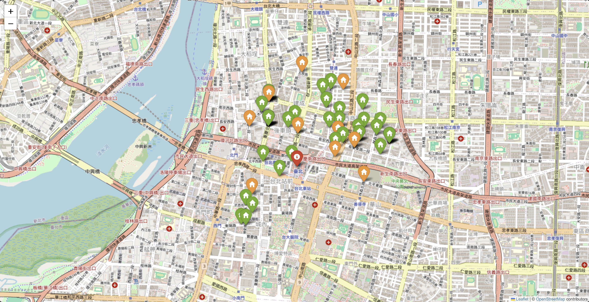

# rental-market-analyzer
An automated data pipeline tool designed to extract rental property listings from a leading real estate portal in Taiwan, enabling geospatial market analysis and tracking using the Google Sheets API.

### 🗂️ Project Files
- `scraper_basic_logic.ipynb`: A lightweight script for quick market data collection.
- `scraper_advanced_asset_tracking.ipynb`: A full-featured system with database simulation to track listing lifecycles and calculate days-on-market.
- `scraper_withGeo-Fencing_asset_tracking.ipynb`: Introduces Geospatial Analysis using open-source Nominatim (OSM) to filter properties within a specific "living circle". Features a robust, two-stage architecture for high-volume data extraction.
- 🚀 **`scraper_Google_Maps_Precision.ipynb` (Latest)**: The ultimate version powered by the **Google Maps Geocoding API**. Delivers enterprise-level address parsing precision, interactive Folium map visualizations, and seamless background backups to Google Drive.

### 🌟 Key Features
* **Enterprise-Grade Geo-Fencing (Google Maps API)**:
    * Replaced open-source OSM with Google Maps Geocoding API for superior address resolution, handling irregular Taiwanese address formats with high concurrency and zero "N/A" errors.
* **Interactive Map Visualization (Folium)**:
    * Automatically generates an interactive HTML map pinpointing all scraped properties.
    * Features color-coded markers (e.g., Green for studios, Orange for apartments) and clickable popups displaying rent, size, and direct links to the listings.
* **Seamless Drive API Integration**:
    * Automatically saves the generated Folium maps to a dynamically resolved target folder in Google Drive.
    * Reuses existing OAuth credentials (`gspread` auth) to bypass secondary mounting/authorization prompts.
* **Two-Stage Robust Architecture**:
    * Decouples the pipeline into "Dynamic DOM Scraping" (Phase 1) and "Data Cleansing & Geo-computation" (Phase 2). Prevents data loss if network issues or server-side rate limits interrupt the process.
* **Anti-Scraping & Infinite Scrolling Breakthrough**:
    * Bypasses the target platform's strict pagination limits using simulated keyboard scrolling (`Keys.END`) and a unique ID memory pool to prevent infinite loops.
* **Multi-Type Polling Automation**:
    * Automatically cycles through different property types (e.g., entire apartments, independent studios) in a single run.
* **Secure Credential Management**:
    * Integrates Colab Secrets (`userdata`) to strictly separate API keys from the codebase, adhering to security best practices.

### 📸 Gallery

**Geo-Fencing Rental Map Overview** *(Click the image to view the interactive script in Colab)*

  

### 🛠️ How to Use
1.  **Environment Setup**: Open the notebook in Google Colab.
2.  **API Key Configuration**: 
    * Obtain a Google Maps API Key (with Geocoding API enabled).
    * In Colab, click the 🔑 **Secrets** icon on the left sidebar. Add a new secret named `GMAPS_API_KEY` and paste your key. Toggle "Notebook access" ON.
3.  **Global Config**: Modify the `CONFIG` section in `Cell 3` to set your target city, anchor point (e.g., University/Workplace), and limits.
4.  **Execute Phase 1 (Scraping)**: Run `Cell 4-1` to extract raw DOM data into memory.
5.  **Execute Phase 2 (Processing)**: Run `Cell 4-2` to calculate distances, apply geo-fencing limits, and push the final dataset to Google Sheets.
6.  **Visualize (Folium)**: Run `Cell 5` to generate the interactive map and automatically back it up to your specified Google Drive folder.

> **Disclaimer**: This project is created strictly for educational purposes and personal portfolio demonstration. It is not intended for commercial use or high-frequency scraping that could burden the target servers.